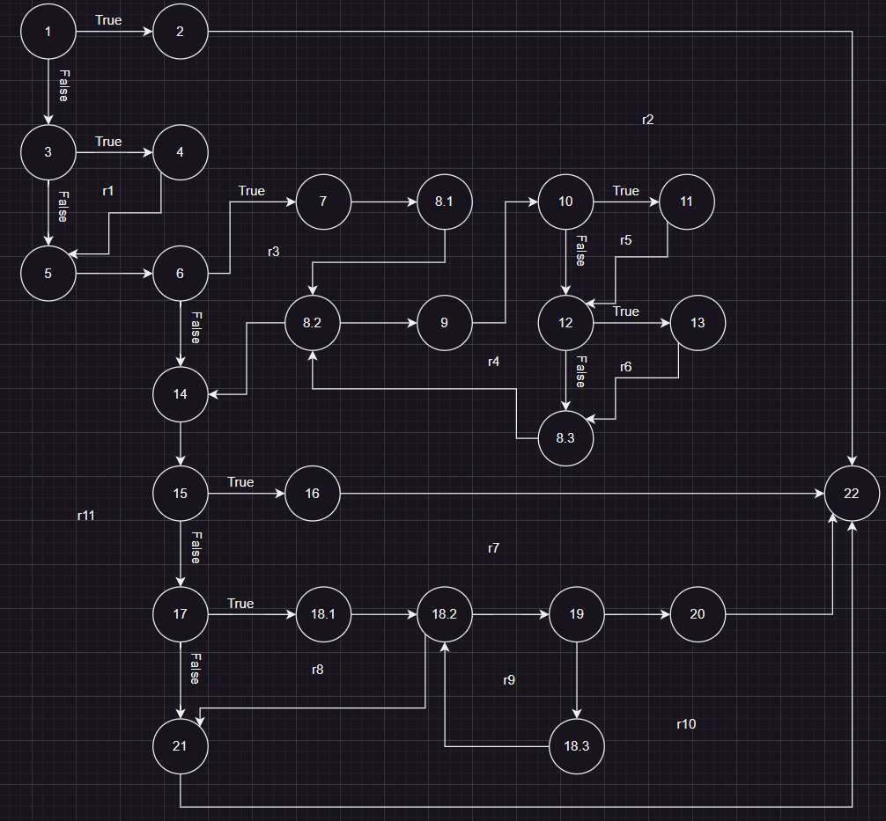
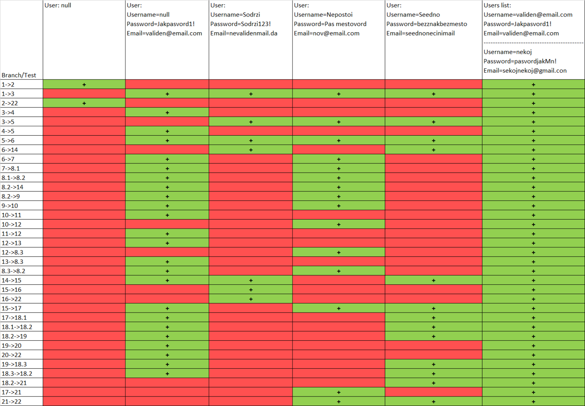

# Втора лабораториска вежба по Софтверско инженерство
## Александар Тркалески, бр. на индекс 216126
## Control Flow Graph 

## Цикломатска комплексност
Цикломатската комплексност ја пресметав како бројот на loops +1, односно региони во Control Flow Graph-от, и добив 11.

## Every Branch

## Тест случаи според критериумот EveryBranch  
Имам вкупно 5 тест случаи:  
1)Првиот тест е за RuntimeException. 
2)Вториот тест е за if условот кога нема да внесам username и како username да го превземам соодветниот email  
3)Третиот тест е if условот кога се проверува дали внесениот email е валиден и исто така и if условот дали password contains username односно дали пасвордот го содржи името илипасвордот е помал од 8 карактери.  
4)Четвртиот тест е кога password има празно место 
5)Петиот тест е за проверката дали password содржи специјален карактер  

## Тест случаи според критериумот Multiple Condition
if (user==null || user.getPassword()==null || user.getEmail()==null)  
// T X X //кога user e null  
// F T X //кога user не е null, но password е null  
// F F T //кога user не е null и password не е null, но email е null   
// F F F //кога сите се внесени односно ни едно не е null 
 
